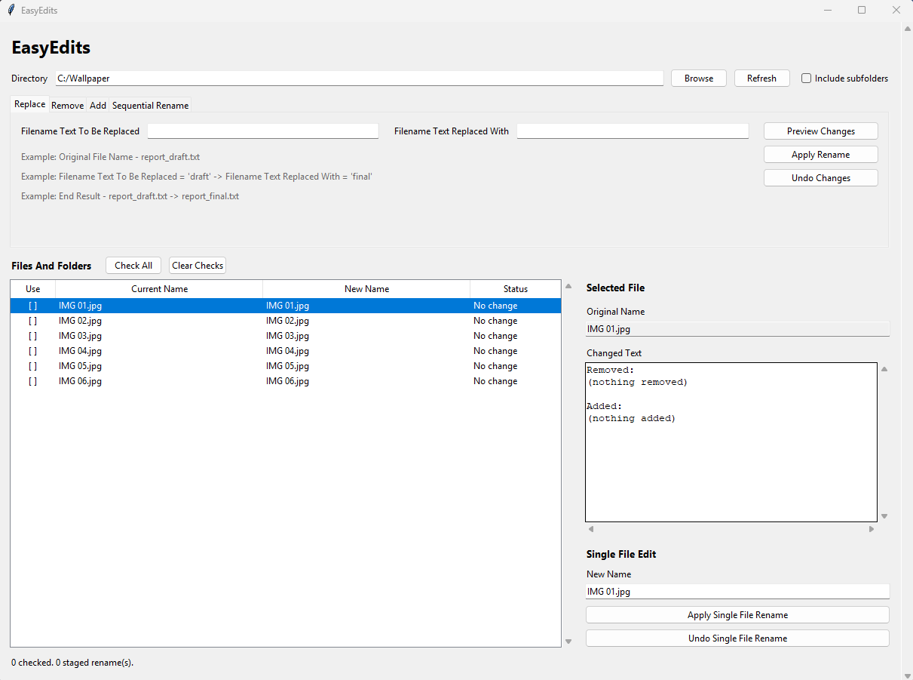
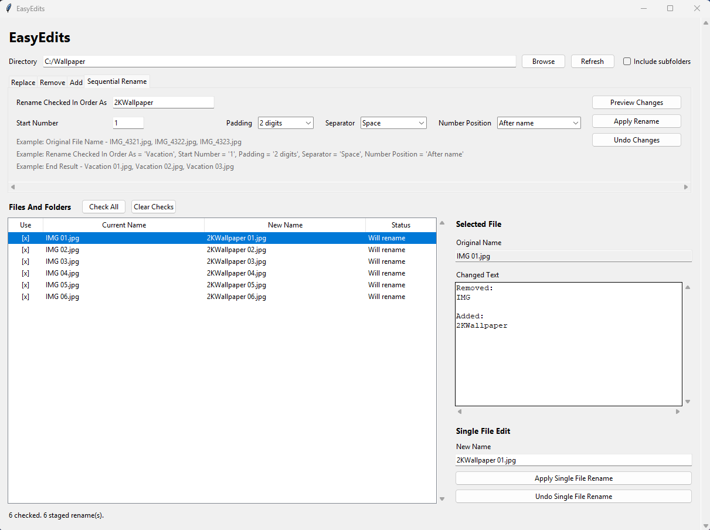

# EasyEdits – File Renamer

  
  

Lightweight Windows tool for batch renaming files — with preview and undo.

## Features

* Batch renaming
* Find / replace text
* Sequential numbering
* Add or remove text
* Date Cleaner
* Separator Edits
* Case Edits
* Preview changes before applying
* Undo support
* Simple desktop interface

## Download

Download the latest version from Releases:
https://github.com/mik3br7/easyedits-file-renamer/releases

## How to Use

1. Download and run `EasyEdits.exe`
2. Click **Browse** to select a folder
3. Select which files to rename (nothing is selected by default)
4. Choose your rename method (Replace, Remove, Add, or Sequential)
5. Click **Preview Changes**
6. Click **Apply Rename**

## Notes

* All processing runs locally (no files leave your machine)
* Files are not selected by default — you must choose what to rename
* The app starts with no folder selected
* First run may show a Windows SmartScreen warning (common for new unsigned apps)

## Source

Full source code is available here:
https://github.com/mik3br7/easyedits-file-renamer

## License

See LICENSE file

